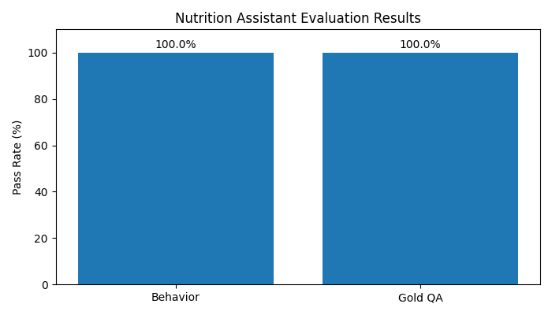

# 🥗 Nutrition Assistant (AI)

An intelligent nutrition assistant designed with a strong focus on **robustness, safety, explainability, and rigorous evaluation**.

---

## 🚀 Overview

This project implements a dual-mode AI system for nutrition assistance:

### 1. Calorie Estimation Mode
- Database-based (no hallucination)
- Accepts multiple food items with quantities
- Maintains meal memory
- Provides structured and explainable output

### 2. Nutrition QA Mode
- Retrieval-based (RAG)
- Grounded answers only
- Resistant to adversarial and noisy inputs
- Safe response generation

---

## 🧠 System Architecture

User Input  
↓  
NLU Layer (Normalization + Parsing + Intent Detection)  
↓  
QA Safety Router (Pre-RAG Guard Layer)  
↓  

Calorie Mode (Database Logic)  
OR  
QA Mode (Retrieval with ChromaDB)  

↓  
Response Formatter  
↓  
Chainlit Interface  

---

## 🔒 Safety & Reliability

A dedicated **QA Safety Router** is used before retrieval:

- Detects misinformation
- Handles out-of-domain queries
- Identifies ambiguous inputs
- Separates mixed intents (calorie + question)

This design ensures:
- No hallucinated answers
- Controlled and grounded responses
- Consistent system behavior

---

## 🧪 Evaluation Framework

A custom evaluation pipeline was implemented with two independent layers:

### 1. Behavior Evaluation (Strict)

Tests system robustness against:
- Adversarial queries
- Typo and noisy inputs
- Mixed intent queries
- Out-of-domain requests
- Nutrition misinformation

### 2. Gold QA Evaluation

- Paraphrased questions
- High similarity thresholds
- Focus on semantic correctness

---

## 📊 Results

| Test Type   | Cases | Pass Rate |
|------------|------|----------|
| Behavior   | 60   | 100%     |
| Gold QA    | 50   | 100%     |

The system demonstrates:
- Zero hallucination behavior
- Strong robustness under noisy and adversarial inputs
- High semantic accuracy in QA

---

## 📈 Visualization

---

## 🧾 Example Queries

### Calorie Mode
apple 200g  
apple200g  
and banana 100g  
what is the total now?  
clear meal  

### QA Mode
Is fruit sugar bad?  
Are carbohydrates unhealthy?  
Can protein replace meals?  
Why is fiber important?  

### Robustness Tests
iz carbz always badd?  
milk 200g is sugar bad?  
pizza is vegetable?  

---

## ⚙️ How to Run

pip install -r requirements.txt  
PYTHONPATH=. chainlit run src/presentation/chainlit_app.py -w  

---

## 🧪 Evaluation Commands

PYTHONPATH=. python eval/evaluate_any.py eval/datasets/eval_cases_qna_behavior.json  
PYTHONPATH=. python eval/evaluate_any.py eval/datasets/eval_cases_qna_gold.json  

---

## 🧩 Key Design Decisions

- Separation of behavior and content evaluation
- Pre-RAG safety layer to eliminate hallucination
- Deterministic calorie estimation using structured data
- Explainable outputs (confidence, match reasoning)
- Modular architecture (NLU / Router / Retrieval / UI)

---

## 🎯 Key Insight

This project focuses not only on achieving high accuracy, but on building a **safe, robust, and explainable AI system**.

---

## 👩‍💻 Author

Fatemeh Niyavand  
University of Naples Federico II  
MSc Data Science

---

## 📌 Notes

- Designed for academic evaluation and real-world robustness
- Handles noisy, ambiguous, and adversarial inputs
- Fully reproducible evaluation pipeline

