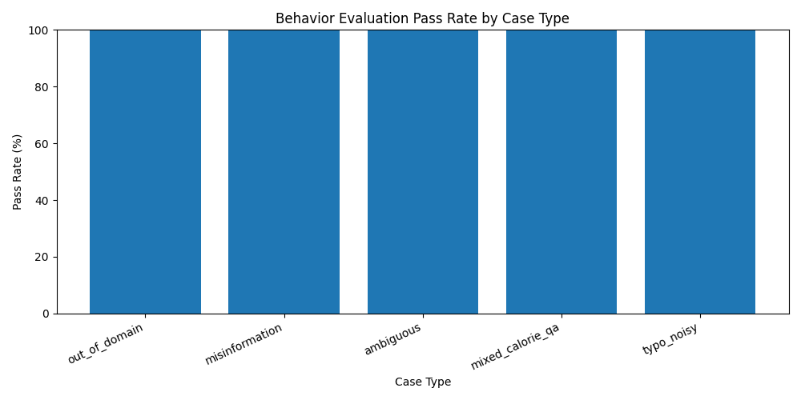

# Nutrition Assistant Evaluation Report

Generated: 2026-04-29 17:51

## 1. Executive Summary

This project evaluates a Nutrition Assistant with two complementary evaluation strategies:

1. **Behavior-based evaluation** checks safety, routing, and robustness.
2. **Gold QA evaluation** checks semantic correctness against reference answers.

The system includes a **pre-RAG QA Safety Router** that catches risky or irrelevant inputs before retrieval. This prevents raw RAG hallucinations and improves reliability.

---

## 2. Behavior-Based Evaluation

Dataset: `eval_cases_qna_behavior.json`

| Metric | Value |
|---|---:|
| Total cases | 60 |
| Passed cases | 60 |
| Failed cases | 0 |
| Pass rate | 100.0% |

### Case Type Breakdown

| Case Type | Total | Passed | Failed | Pass Rate |
|---|---:|---:|---:|---:|
| out_of_domain | 10 | 10 | 0 | 100.00% |
| misinformation | 15 | 15 | 0 | 100.00% |
| ambiguous | 15 | 15 | 0 | 100.00% |
| mixed_calorie_qa | 10 | 10 | 0 | 100.00% |
| typo_noisy | 10 | 10 | 0 | 100.00% |

---

## 3. Gold QA Evaluation

Dataset: `eval_cases_qna_gold.json`

| Metric | Value |
|---|---:|
| Total cases | 5 |
| Passed cases | 5 |
| Failed cases | 0 |
| Pass rate | 100.0% |

The Gold QA dataset focuses on content correctness. It uses reference answers and similarity-based content scoring.

---

## 4. Dual Scoring

The evaluator reports two complementary dimensions:

| Score Type | Purpose |
|---|---|
| Behavior Score | Measures safety behavior, routing quality, refusal behavior, clarification, and avoidance of unsafe claims |
| Content Score | Measures answer similarity to reference answers |

This separation is important because a safe response and a semantically complete response are not the same thing.

---

## 5. Before vs After Safety Router

Before adding the QA Safety Router, strict behavior evaluation exposed failures such as:

- out-of-domain questions being sent to RAG
- misinformation questions receiving raw retrieved answers
- ambiguous questions not asking for clarification
- mixed calorie + QA inputs causing mode confusion
- typo/noisy queries being mishandled

After adding the pre-RAG QA Safety Router, the behavior evaluation reached **100.0%**.

---

## 6. Failure Analysis

Latest behavior run:

- Failed cases: **0**

No failed cases were found in the latest behavior evaluation run.

---

## 7. Conclusion

The system now demonstrates:

- robust pre-RAG safety routing
- behavior-based QA validation
- content-based Gold QA validation
- explainable evaluation reports
- clear case-type breakdowns

This makes the project significantly stronger than a simple RAG chatbot because it evaluates not only whether the assistant answers, but whether it behaves safely and correctly across difficult inputs.
